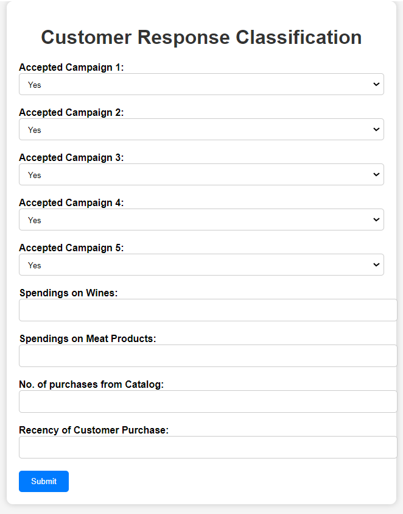
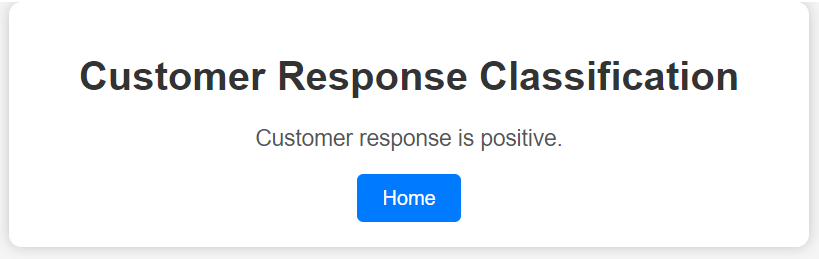
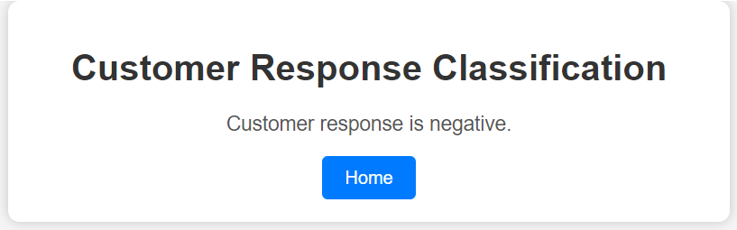

# Customer Personality Analysis Project

Welcome to the Customer Personality Analysis project repository! This project aims to analyze customer data to understand their preferences and behavior. The analysis is performed using a Jupyter notebook and deployed as a Flask web application.

## Repository Structure

- `dataset.csv`: This file contains the dataset with customer information, including demographics and purchase behavior.
- `notebook.ipynb`: A Jupyter notebook where the analysis and modeling are performed.
- `app.py`: A Flask web application for visualizing the results and making predictions.
- `templates/`: This directory contains HTML templates for the web app.
  - `index.html`: The main page of the web application.
  - `true.html`: Page displaying results for positive responses.
  - `false.html`: Page displaying results for negative responses.

## Dataset

The `dataset.csv` file contains the following columns:
- `id`
- `year_birth`
- `education`
- `marital_status`
- `income`
- `kidhome`
- `teenhome`
- `dt_customer`
- `recency`
- `mntwines`
- `mntfruits`
- `mntmeatproducts`
- `mntfishproducts`
- `mntsweetproducts`
- `mntgoldprods`
- `numdealspurchases`
- `numwebpurchases`
- `numcatalogpurchases`
- `numstorepurchases`
- `numwebvisitsmonth`
- `acceptedcmp1`
- `acceptedcmp2`
- `acceptedcmp3`
- `acceptedcmp4`
- `acceptedcmp5`
- `complain`
- `Z_costcontact`
- `z_revenue`
- `response`

## Jupyter Notebook

The `notebook.ipynb` file contains the data analysis, visualization, and modeling steps. Here is a summary of what's covered:
1. Data Preprocessing:
   - Importing libraries (NumPy, Pandas, Matplotlib, Seaborn).
   - Loading the dataset and handling missing values.
   - Dropping unnecessary columns.
   
2. Data Visualization:
   - Birth year distribution.
   - Pie chart of education distribution.
   - Pie chart of marital status distribution.
   - Income distribution.
   - Stacked bar chart of kidhome and teenhome.
   - Histogram of recency.
   - Barplot of spending in various product categories.
   - Histogram of purchases through various channels.
   - Distribution of numwebvisitsmonth.
   - Pie chart showing the percentage who accepted each campaign.
   - Pie chart of the complaint column.
   - Distribution of responses.

3. Data Modeling:
   - Performing one-hot encoding on education and marital status.
   - Correlation heatmap of all columns.
   - Selecting the top 9 most correlated variables with the response.
   - Defining the independent and dependent variables (X and y).
   - Balancing the data using the SMOTE technique.
   - Splitting the data into training and testing sets.
   - Training a Random Forest Classifier.
   - Standardizing the data and training with Support Vector Classifier and Logistic Regression.
   - Evaluating the models and saving the best-performing model as `model.pkl` using Pickle.

## Flask Web Application
The project also includes a Flask web application (`app.py`) that allows users to predict in real-time. The `templates` directory contains HTML files for the web app, including `index.html`, `true.html`, and `false.html`.

## Running the Flask Web App

To run the Flask web app, follow these steps:
1. Install the required libraries listed in `requirements.txt` using `pip install -r requirements.txt`.
2. Run the Flask app by executing `python app.py`.
3. Open the web app in your browser by navigating to `http://localhost:5000`.

Feel free to reach out if you have any questions or need further assistance.

## Webpage Glimpse:

